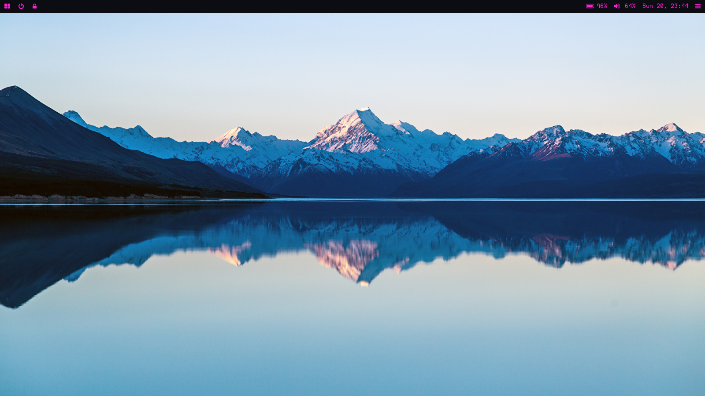

# AwesomeWM Rice - Updated for 2021

As 2021 rolls around, it's time to update my Linux machine. I also decided to redesign my window manager, and also use a new window manager. I will daily drive AwesomeWM from this point on - here are the files if you also want to configure yours like mine.

### Main Apps

* Window Manager: AwesomeWM

* Panel: Polybar

* Terminal Emulator: Alacritty

* Text Editor: Vim

* Menu Application: Rofi

* Compositor: Picom (jonaburg fork)

* Notifications: Xfce4 Notifications

* Theme: Sweet

* Icons: Papirus

* Fonts: [Hermit](https://pcaro.es/p/hermit/), [Monoid](https://larsenwork.com/monoid/), [JetBrains Mono Nerd Font](https://github.com/ryanoasis/nerd-fonts/releases/tag/v2.1.0), [Oswald](https://fonts.google.com/specimen/Oswald)

### One Line Install:

`sudo apt-get install awesome vim pavucontrol rofi xbindkeys feh libnotify-dev notification-daemon xfce4-notifyd network-manager blueman bluez git build-essential`

For items not found in the standard repositories (You may need to compile from source):

* Polybar https://github.com/polybar/polybar

* Alacritty: https://github.com/alacritty/alacritty

* Picom: https://github.com/streamsniperrty/picom-config

* i3lock: https://github.com/Raymo111/i3lock-color

* Vim Extra: https://github.com/streamsniperrty/vim-config

### Final Steps

* Copy the config files for:
  
  * Awesome 
  
  * Polybar 
  
  * Alacritty
  
  * Picom
  
  * Rofi
  
  * Vim
  
* Make sure to copy the fonts into `~/.local/share/fonts`.

* Make sure to set `autostart.sh` in ~/.config/awesome, `launch.sh` in `~/.config/polybar`, `volume.sh` in `~/.config/polybar/scripts`, and `battery.sh` in `~/.config/polybar/scripts` as executable. 

### Bonus

If you want to change the LightDM Greeter, go to https://wiki.archlinux.org/index.php/LightDM which will show you how to change the greeter. The greeter I recommend is the `lightdm-webkit2-greeter`.
